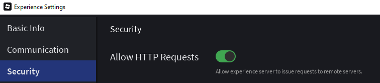

# BloxTube
A Roblox map that allows you to watch YouTube videos using HTTP requests.

### WARNING:
This project is  made for educational purposes. It is not affiliated with any company. Streaming copyrighted video content through third-party tools may violate the Terms of Service of the platforms. Use at your own risk.
Also you can get rate-limited.

### Requirements:
* Python 3.x
* FFmpeg (added to system PATH)
* Python packages: `pip install yt-dlp pillow`

 ### ENABLE HTTP REQUESTS
 Make sure to enable HTTP requests in the game settings, or else this wont work.
 
 

 If you have anything you want to ask me (could be anything, dont be hesitant) email me at contact@araslmao.me. I will respond.

